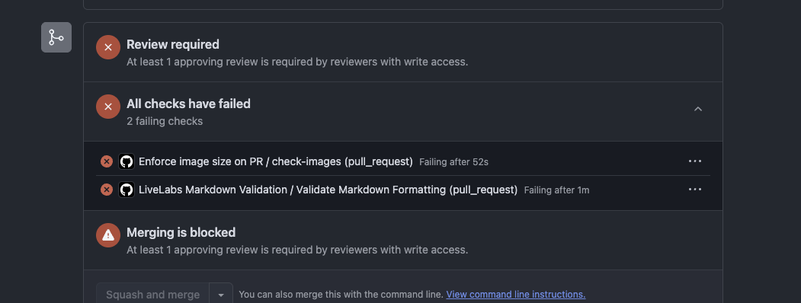
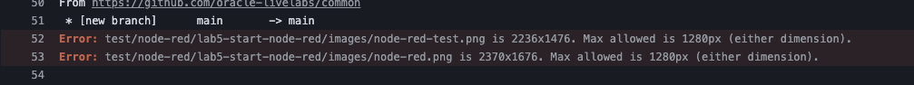
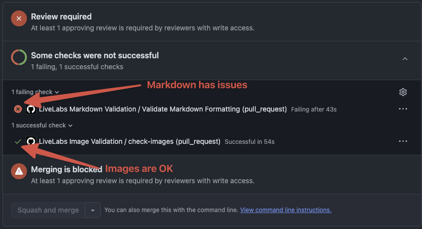
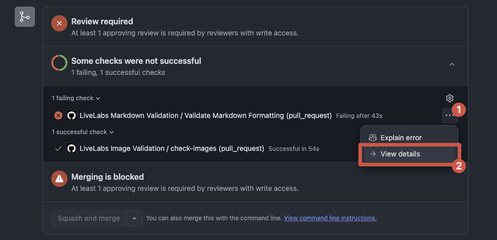
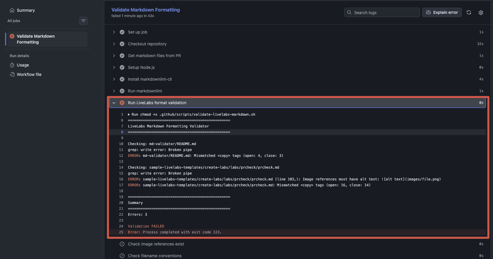

# Pull Request Automated Checks

## Introduction

When you submit a Pull Request (PR) to the LiveLabs repository, automated checks run to validate your content. These checks help ensure consistency, quality, and compliance with LiveLabs standards before your workshop is reviewed.

This document explains the automated workflows that run on your PR and how to resolve any issues they may flag.

Estimated Time: 10 minutes

### About PR Checks

LiveLabs uses GitHub Actions to automatically validate PRs. Two main workflows run on every PR:

1. **LiveLabs Image Validation** - Ensures all images are within the 1280px maximum dimension
2. **LiveLabs Markdown Validation** - Checks that your markdown files follow LiveLabs formatting standards

If any check fails, your PR will show a red "X" next to the failing check. You must fix the issues before your PR can be merged.



### Objectives

In this lab, you will:
* Understand the automated checks that run on PRs
* Learn what each check validates
* Know how to fix common issues flagged by the checks
* View check results in GitHub

### Prerequisites

This lab assumes you have:
* A GitHub account
* A Pull Request submitted to the LiveLabs repository
* Basic understanding of markdown syntax

## Task 1: Understanding the Image Size Check

The **LiveLabs Image Validation** workflow ensures that all images in your PR do not exceed 1280 pixels in width or height. Large images slow down page load times and create a poor user experience.

1. What the check validates:

    | Check | Requirement |
    | --- | --- |
    | Maximum width | 1280 pixels |
    | Maximum height | 1280 pixels |
    | File types checked | PNG, JPG, JPEG |

2. When this check runs:

    - When a PR is opened
    - When new commits are pushed to an existing PR
    - When a PR is reopened

3. If your images fail this check, you will see an error like:

    ```
    ERROR: images/screenshot.png is 1920x1080. Max allowed is 1280px (either dimension).
    ```

    

4. To fix oversized images, use the **OptiShot** tool. For detailed instructions on using OptiShot, see the [OptiShot User Manual](../optishot/optishot.md).

## Task 2: Understanding the Markdown Validation Check

The **LiveLabs Markdown Validation** workflow ensures your markdown files follow LiveLabs formatting standards. It checks both standard markdown rules and LiveLabs-specific conventions.

1. What the check validates:

    | Category | Checks Performed |
    | --- | --- |
    | Structure | Single H1 per file, required sections present |
    | Headers | Proper hierarchy (H1 > H2 > H3), correct task format |
    | Images | Alt text present, referenced images exist, lowercase filenames |
    | LiveLabs syntax | Balanced `<copy>` tags, proper note format |
    | Filenames | Lowercase, no spaces |

2. Required sections in every lab:

    | Section | Format | Required |
    | --- | --- | --- |
    | Title | `# Lab Title` | Yes |
    | Acknowledgements | `## Acknowledgements` | Yes |
    | Objectives | `### Objectives` | Yes |
    | Introduction | `## Introduction` (for labs with Tasks) | Yes |
    | Estimated Time | `Estimated Time: X minutes` | Yes |

3. Common errors and how to fix them:

    **Missing Acknowledgements section:**

    ```markdown
    ## Acknowledgements

    * **Author** - Your Name, Your Title
    * **Last Updated By/Date** - Your Name, Month Year
    ```

    **Image missing alt text:**
    ```markdown
    Wrong
    

    Correct
    
    ```

    **Mismatched copy tags:**
    ```markdown
    Wrong
    <copy>SELECT * FROM table

    Correct
    <copy>SELECT * FROM table</copy>
    ```

    **Task header format:**
    ```markdown
    Wrong
    ## Task One: Do Something

    Correct
    ## Task 1: Do Something
    ```

4. Files that are checked:

    - All `.md` files in your PR
    - Excludes `node_modules/` and `.github/` directories

## Task 3: Viewing Check Results

After you submit a PR, you can view the status of automated checks in GitHub.

1. Navigate to your Pull Request on GitHub.

2. Scroll down to the **Checks** section at the bottom of the PR.

3. You will see the status of each check:

    | Status | Meaning |
    | --- | --- |
    | Green checkmark | Check passed |
    | Red X | Check failed - action required |
    | Yellow circle | Check is running |

    Example
    

4. To view details of a failed check:

    - Click on **Details** next to the failed check
    - Review the error messages in the log output
    - The log will indicate which file(s) and line(s) have issues

    

    

5. After fixing issues locally:

    - Commit your fixes
    - Push to your branch
    - The checks will automatically re-run

## Task 4: Running Checks Locally (Optional)

You can run the same checks locally before submitting a PR to catch issues early. This saves time by identifying issues before the automated checks run on your PR.

### Image Size Check

1. Use OptiShot for a graphical interface - see the [OptiShot User Manual](../optishot/optishot.md).

### Markdown Validation Check

The markdown validation script is available for both **Linux/macOS (Bash)** and **Windows (PowerShell)**.

#### Option A: Linux / macOS (Bash)

1. Download the validation script:

    ```bash
    <copy>
    curl -O https://raw.githubusercontent.com/oracle-livelabs/common/main/md-validator/.github/scripts/validate-livelabs-markdown.sh
    </copy>
    ```

2. Make it executable:

    ```bash
    <copy>
    chmod +x validate-livelabs-markdown.sh
    </copy>
    ```

3. Run on your workshop directory:

    ```bash
    <copy>
    ./validate-livelabs-markdown.sh /path/to/your/workshop
    </copy>
    ```

4. Or run on specific files:

    ```bash
    <copy>
    ./validate-livelabs-markdown.sh introduction.md lab1.md lab2.md
    </copy>
    ```

5. Or run on all markdown files in the current directory:

    ```bash
    <copy>
    ./validate-livelabs-markdown.sh
    </copy>
    ```

#### Option B: Windows (PowerShell)

1. Download the PowerShell validation script:

    ```powershell
    <copy>
    Invoke-WebRequest -Uri "https://raw.githubusercontent.com/oracle-livelabs/common/main/md-validator/.github/scripts/validate-livelabs-markdown.ps1" -OutFile "validate-livelabs-markdown.ps1"
    </copy>
    ```

2. If you encounter an execution policy error, you may need to allow script execution for the current session:

    ```powershell
    <copy>
    Set-ExecutionPolicy -ExecutionPolicy Bypass -Scope Process
    </copy>
    ```

3. Run on your workshop directory:

    ```powershell
    <copy>
    .\validate-livelabs-markdown.ps1 C:\path\to\your\workshop
    </copy>
    ```

4. Or run on specific files:

    ```powershell
    <copy>
    .\validate-livelabs-markdown.ps1 introduction.md lab1.md lab2.md
    </copy>
    ```

5. Or run on all markdown files in the current directory:

    ```powershell
    <copy>
    .\validate-livelabs-markdown.ps1
    </copy>
    ```

#### Understanding the Output

Both scripts provide color-coded output:

| Color | Meaning |
| --- | --- |
| Red (ERROR) | Must be fixed before PR can be merged |
| Green (PASS) | File passed all required checks |

Example output:

```
================================================
LiveLabs Markdown Formatting Validator
================================================

Checking: introduction.md
PASS: introduction.md passed all required checks

Checking: lab1.md
ERROR: lab1.md: Missing '## Acknowledgements' section
ERROR: lab1.md: Missing '### Objectives' section

================================================
Summary
================================================
Errors: 2

Validation FAILED
```

#### Validation Rules Reference

The script checks for the following rules:

| Rule | Description |
| --- | --- |
| H1 Title | First non-empty line must be an H1 (`# Title`) |
| Single H1 | Only one H1 header allowed per file |
| Acknowledgements | Must have `## Acknowledgements` section |
| Image Alt Text | Images must have alt text: `` |
| YouTube Format | Use format `[](youtube:VIDEO_ID)` |
| Task Format | Tasks should use `## Task N: Description` |
| Copy Tags | `<copy>` and `</copy>` tags must be balanced |
| Introduction | Labs with Tasks must have `## Introduction` |
| Objectives | Must have `### Objectives` section |
| Estimated Time | Must include `Estimated Time:` (or `Estimated Workshop Time:` for introduction.md) |
| Lowercase Images | Image filenames must be lowercase |

5. Review the output and fix any errors before submitting your PR.

## FAQ

### Why did my PR fail the image check when the images look fine?

The check measures actual pixel dimensions, not file size. An image may appear small on screen but have high resolution. Use OptiShot or the resize script to reduce dimensions to 1280px maximum.

### Can I use uppercase letters in filenames?

No. All markdown files and image files must use lowercase filenames. Rename using `git mv`, files like `Screenshot.PNG` to `screenshot.png`.

### What if I have a legitimate reason to exceed 1280px?

The 1280px limit is a LiveLabs standard for consistency and performance. If you have a special case, contact the LiveLabs team for guidance.

### The check says I have mismatched copy tags, but I can't find the issue.

Check for:
- Missing closing `</copy>` tags
- Extra opening `<copy>` tags
- Copy tags split across multiple lines incorrectly

Use a text editor's find feature to count `<copy>` and `</copy>` occurrences - they should match.

### Can I skip the automated checks?

No. All PRs must pass the automated checks before they can be merged. This ensures quality and consistency across all LiveLabs workshops.

## Acknowledgements

* **Author** - LiveLabs Team
* **Last Updated By/Date** - LiveLabs Team, January 2026
