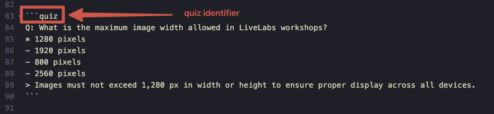
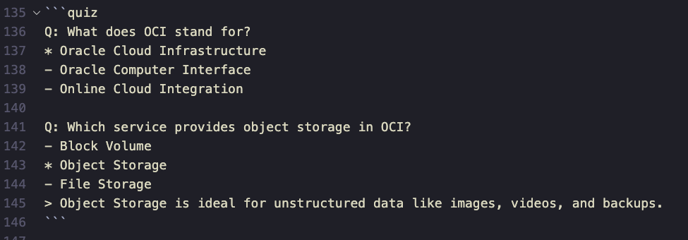
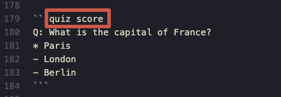
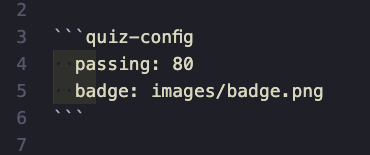

# Adding Interactive Quizzes to Your Workshop

```quiz-config
  passing: 80
  badge: images/badge.png
```

## Introduction

Interactive quizzes allow workshop authors to test learners' knowledge directly within the lab content. Quizzes are written in markdown using a simple syntax and are automatically rendered as interactive components with visual feedback.

**Use quizzes to reinforce key concepts and help learners validate their understanding before moving to the next task.**

### About Quizzes

Quizzes support both single-answer (radio buttons) and multiple-answer (checkboxes) questions. After submitting an answer, learners receive immediate visual feedback showing correct and incorrect selections. Optional explanations can be displayed after answering.

Estimated Time: x

### Objectives

In this lab, you will:
* Learn the quiz markdown syntax
* Create single-answer questions
* Create multiple-answer questions
* Add explanations to quiz answers
* Enable quiz scoring with badge rewards
* Understand best practices for quiz placement

### Prerequisites

This lab assumes you have:
* A LiveLabs workshop in development
* Basic knowledge of markdown syntax

## Task 1: Understanding Quiz Syntax

Quizzes are defined using fenced code blocks with the `quiz` language identifier.

1. The basic structure of a quiz block:




```
Q: Your question text here?
* Correct answer (marked with asterisk)
- Wrong answer (marked with dash)
- Another wrong answer
> Optional explanation shown after answering
```


1. Syntax reference:

    | Element | Syntax | Description |
    | --- | --- | --- |
    | Question | `Q:` | Starts a new question (required) |
    | Correct answer | `*` | Marks a correct answer (at least one required) |
    | Wrong answer | `-` | Marks an incorrect answer |
    | Explanation | `>` | Optional explanation shown after answering |

2. The quiz renderer automatically determines the input type:
    - **Single correct answer** = Radio buttons (select one)
    - **Multiple correct answers** = Checkboxes (select all that apply)

## Task 2: Create a Single-Answer Quiz

Create a quiz where only one answer is correct.

1. Add a quiz block to your markdown file:

```
Q: What is the maximum image width allowed in LiveLabs workshops?
* 1280 pixels
- 1920 pixels
- 800 pixels
- 2560 pixels
> Images must not exceed 1,280 px in width or height to ensure proper display across all devices.
```

2. This renders as a quiz with radio buttons when adding quiz as the code identifier:

```quiz
Q: What is the maximum image width allowed in LiveLabs workshops?
* 1280 pixels
- 1920 pixels
- 800 pixels
- 2560 pixels
> Images must not exceed 1,280 px in width or height to ensure proper display across all devices.
```

3. When the learner clicks **Check Answer**:
    - Correct selection shows a green checkmark
    - Incorrect selection shows a red X
    - Missed correct answers are highlighted in yellow
    - The explanation appears below the options

## Task 3: Create a Multiple-Answer Quiz

Create a quiz where multiple answers are correct. Use multiple asterisks (`*`) to mark all correct options.

1. Add a quiz block with multiple correct answers:

```
Q: Which of the following are valid Oracle Cloud Infrastructure (OCI) compute shapes? (Select all that apply)
* VM.Standard.E4.Flex
* BM.Standard3.64
- VM.SuperFast.999
* VM.Standard.A1.Flex
- EC2.Large
> OCI offers VM (Virtual Machine) and BM (Bare Metal) shapes. The E4, Standard3, and A1 series are all valid OCI shapes.
```


2. This renders as a quiz with checkboxes:

```quiz
Q: Which of the following are valid Oracle Cloud Infrastructure (OCI) compute shapes? (Select all that apply)
* VM.Standard.E4.Flex
* BM.Standard3.64
- VM.SuperFast.999
* VM.Standard.A1.Flex
- EC2.Large
> OCI offers VM (Virtual Machine) and BM (Bare Metal) shapes. The E4, Standard3, and A1 series are all valid OCI shapes.
```

3. The learner must select ALL correct answers to see "Correct!" - partial selections show which answers were missed.

## Task 4: Add Multiple Questions

You can include multiple questions in a single quiz block by adding another `Q:` line.

1. Add multiple questions:



```quiz
Q: What does OCI stand for?
* Oracle Cloud Infrastructure
- Oracle Computer Interface
- Online Cloud Integration

Q: Which service provides object storage in OCI?
- Block Volume
* Object Storage
- File Storage
> Object Storage is ideal for unstructured data like images, videos, and backups.
```

2. Each question is rendered as a separate quiz component:

```quiz
Q: What does OCI stand for?
* Oracle Cloud Infrastructure
- Oracle Computer Interface
- Online Cloud Integration

Q: Which service provides object storage in OCI?
- Block Volume
* Object Storage
- File Storage
> Object Storage is ideal for unstructured data like images, videos, and backups.
```

## Task 5: Enable Quiz Scoring

Track learner progress across multiple quizzes and reward completion with a downloadable badge.

1. Add `score` after `quiz` to mark a quiz as contributing to the total score:



```
Q: What is the capital of France?
* Paris
- London
- Berlin
```

When you add score it changes to quiz score (see Task 2 for example without score):

```quiz score
Q: What is the capital of France?
* Paris
- London
- Berlin
```


```quiz score
Q: What is the capital of the Netherlands?
* Amsterdam
- The Hague
- Utrecht
```

1. Scored quizzes display a "Scored Quiz" label and have an orange left border to distinguish them from practice quizzes.

2. A progress tracker automatically appears at the bottom of the page showing:
    - Number of quizzes answered
    - Current score percentage
    - Pass/fail status when all quizzes are completed

## Task 6: Configure Passing Score and Badge

Set a passing percentage and provide a badge image for learners who pass.

1. Add a `quiz-config` block anywhere in your markdown (typically at the top):




```
passing: 80
badge: images/badge.png
```


2. Configuration options:

    | Option | Default | Description |
    | --- | --- | --- |
    | `passing` | 80 | Minimum percentage to pass (0-100) |
    | `badge` | none | Path to badge image for download |

3. Create your badge image and place it in the `images` folder:

    ```
    labs/
      myworkshop/
        myworkshop.md
        images/
          badge.png      <- Your badge image
          screenshot1.png
    ```

4. When learners complete all scored quizzes with a passing score:
    - The progress bar turns green
    - A "Download Your Badge" button appears
    - Clicking the button downloads the badge image

5. If learners don't pass:
    - The progress bar turns red
    - They can click "Try Again" on any quiz to retry
    - The score updates in real-time as they improve

## Task 7: Best Practices

Follow these guidelines to create effective quizzes.

1. **Placement**: Add quizzes at the end of a task or section to reinforce key concepts just covered.

2. **Question clarity**: Write clear, unambiguous questions. Avoid trick questions.

3. **Answer order**: Randomize the position of correct answers - don't always put them first or last.

4. **Explanations**: Always include explanations for educational value, especially for complex topics.

5. **Number of options**: Use 3-5 answer options. Too few makes it too easy; too many becomes overwhelming.

6. **Multiple-answer hints**: When using multiple correct answers, indicate this in the question (e.g., "Select all that apply").

    | Do | Don't |
    | --- | --- |
    | "Which are valid shapes? (Select all that apply)" | "Which are valid shapes?" |
    | "What is the default port for SSH?" | "What port might SSH use?" |
    | Clear, specific questions | Vague or ambiguous wording |

7. **Testing**: Always preview your workshop to verify quizzes render correctly and answers are marked appropriately.

## Summary

You have learned how to:
- Create single-answer quizzes with radio buttons
- Create multiple-answer quizzes with checkboxes
- Add explanations to provide educational context
- Enable quiz scoring to track learner progress
- Configure passing scores and badge rewards
- Follow best practices for quiz design

Quizzes are a powerful way to engage learners, validate their understanding, and reward completion with badges.

## Acknowledgements

* **Author** - LiveLabs Team
* **Last Updated By/Date** - LiveLabs Team, January 2026
