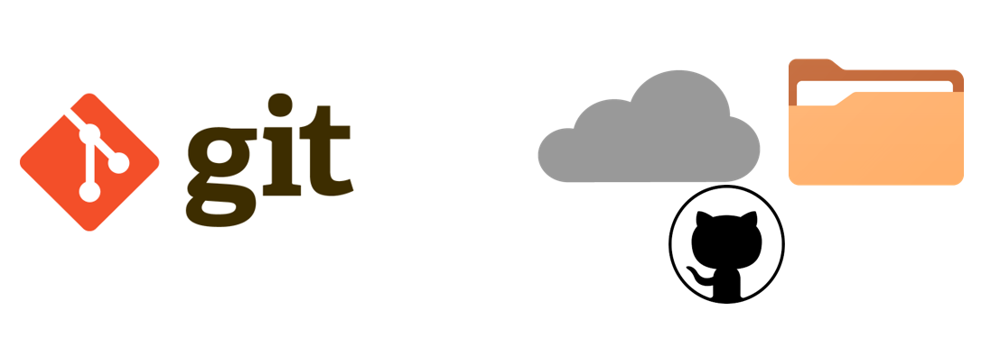
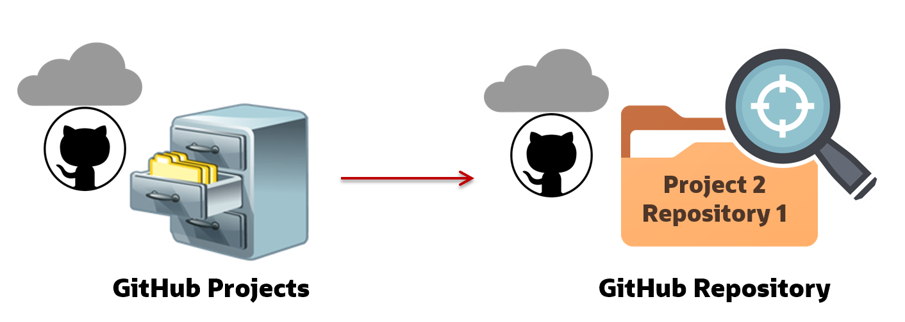
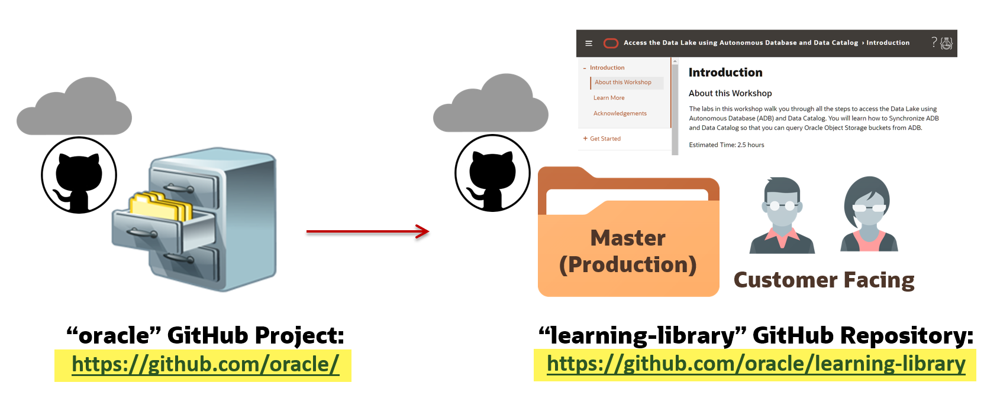
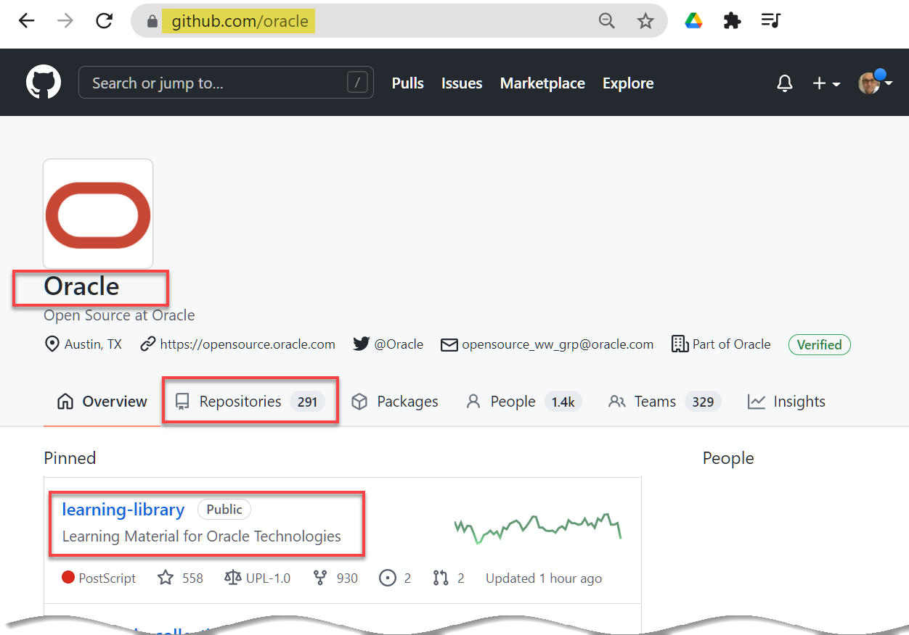
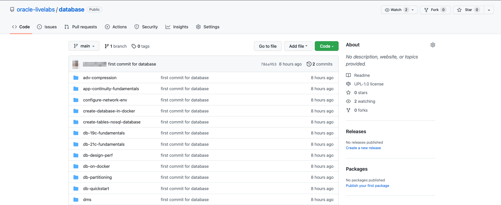
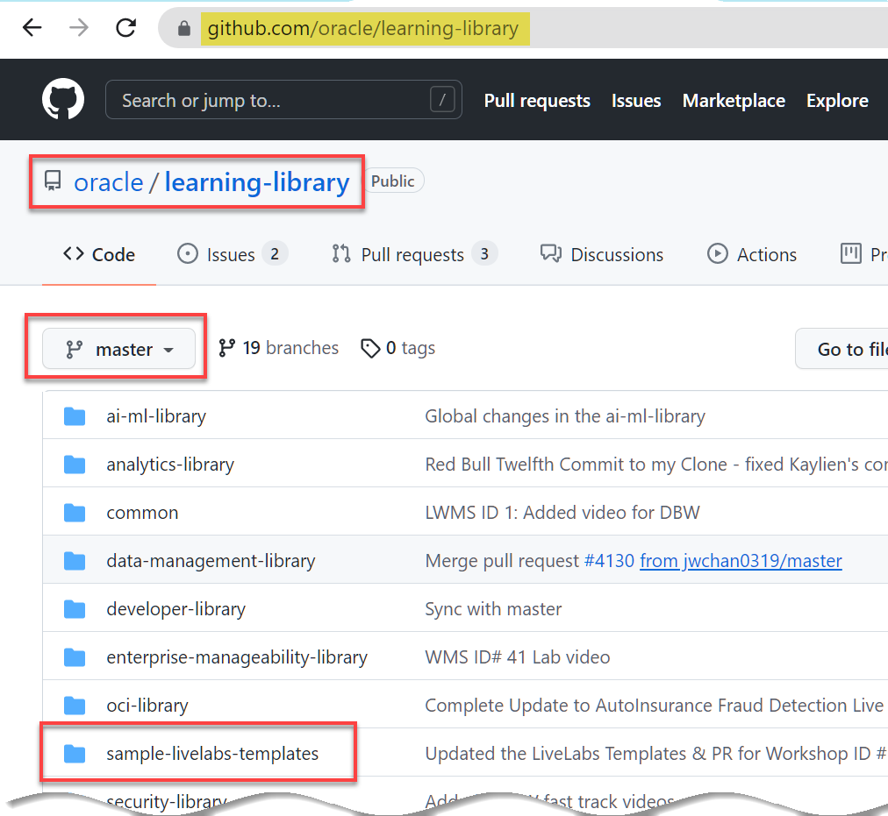
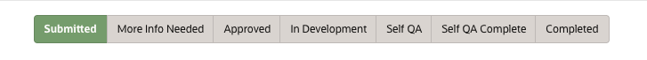
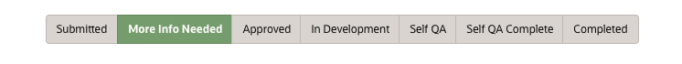
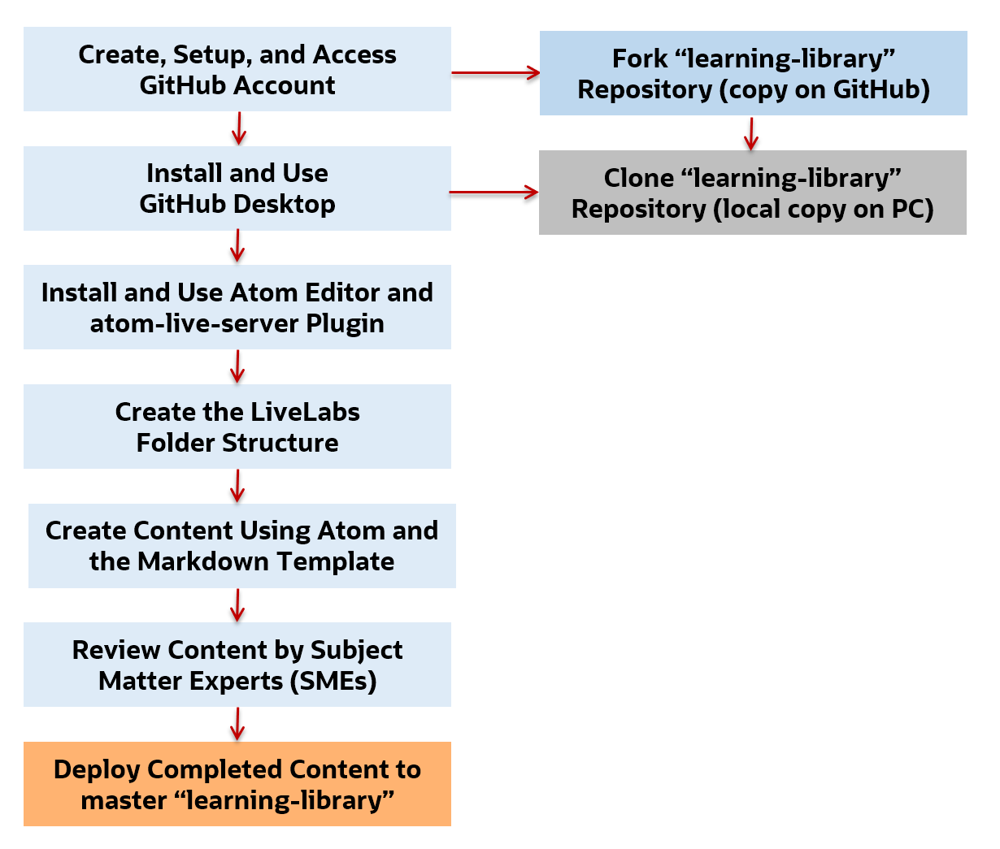

# Introduction to Labs and Workshops

The labs in this workshop walk you through all the steps to **develop workshops** for LiveLabs. 

  > **Note:** You can find information about creating images for compute instances and storing them in Marketplace in the [Creating Compute Images for Marketplace](https://oracle.github.io/learning-library/sample-livelabs-templates/create-labs/labs/workshops/compute/) LiveLabs workshop.

## What are Labs and Workshops?
A lab is a new model adopted by the Database (DB) organization to enhance the tutorial experience. Labs are what the User Assistance community commonly knew as Oracle by example (OBE). Labs can be combined to form a workshop, formerly known as Hands-on Lab or HOL, or a Learning Path.

An individual Markdown (.md) file is called a lab. A collection of labs is called a workshop. A LiveLabs workshop must contain more than one lab. You cannot create a single lab LiveLabs (LL) workshop. In most cases, this is not a problem since most of the LL workshops contain at least one common lab titled **Get Started** that guides the user on the different types of Cloud accounts.

## What is GitHub?
GitHub is a cloud-based version control system designed for software developers.
  * At the core of GitHub is Git, an open source version control system that manages file versions and tracks the changes made by the members of a repository.
  * The Hub is a cloud-based repository that manages storage of the files and provides a folder structure.
  

## GitHub Projects and Repositories
GitHub is organized by projects. Each project has its own repository (commonly referred to as repo) that is accessed through a unique URL. As of January 2020, there were more than 190 million repositories on GitHub.

In the following simplified example, the three-drawer filing cabinet represents three GitHub projects (one drawer per project). Each project can contain one or more repositories, represented by folders in the example. In this example, project 2 (second drawer) has three repositories (folders) and we are viewing one of those repositories.

  

## Oracle GitHub Project and learning-library Repository

At Oracle, we have a GitHub project named **Oracle** which has **305** repositories as of March 15th, 2022. One of the repositories in the **Oracle** GitHub project is named **learning-library**. All of the LiveLabs workshops that you and others create are stored in the **learning-library** repository. This repo is sometimes referred to as **Production** since it's where customers view the completed LiveLabs workshops.

+ You can access the **Oracle** GitHub project using the following URL:
  [https://github.com/oracle](https://github.com/oracle)

  

+ You can access the **Oracle** GitHub project repositories using the following URL:
  [https://github.com/orgs/oracle/repositories](https://github.com/orgs/oracle/repositories)

  

+ You can access **Oracle**'s GitHub project **learning-library** repository directly using the following URL which you should bookmark as you will use it often:
  [https://github.com/oracle/learning-library](https://github.com/oracle/learning-library)

  

  The highlighted **sample-livelabs-templates** folder contains this workshop and also the available Livelabs templates.

  > **Note:** The term **learning-library** that we reference in this workshop is the GitHub repository for the **Oracle** GitHub project. It is NOT the same as **Oracle Learning Library (OLL)** used formerly in the OBE world. OLL is an online resource for content about Oracle products [https://apexapps.oracle.com/pls/apex/f?p=44785:1](https://apexapps.oracle.com/pls/apex/f?p=44785:1).

## LiveLabs Workshop Workflow

You can watch the [video 0:18 - 16:35](https://otube.oracle.com/media/LiveLabs%20Workshops%20Workflow%20WMS%202.0%20-%20LiveLabs%20-%20Office%20Hours%20-%2002-01-2022/1_nc5xgue2) for an overview of LiveLabs workshop workflow and different statuses of a workshop.

Before you start, please check LiveLabs ([developer.oracle.com/livelabs](https://developer.oracle.com/livelabs)) to see if there is already a workshop similar to the content you want to create. Please also check WMS ([bit.ly/oraclewms](https://bit.ly/oraclewms)) to see if there is already a workshop in development that resembles your content. If so, please contact that workshop team to see if you can cooperate on the workshop. If not, please proceed.

In order for a workshop to go from an idea to a LiveLabs workshop in production, it has to go through the following phases or statuses in WMS. You can refer to this section to see your current and next steps.

1. After workshop team submits the workshop request (see details in Lab 1 -> Task 1), the workshop is in *Submitted* status. The workshop's *council* group will review the workshop within 2-3 business days. Council will either approve the workshop and move it to *Approved*, or ask the workshop team for more information and move it to *More Info Needed*.
>**Note:** If workshop teams have not heard back from council for more than 3 business days, please follow up with your council group. To find your council members, go to WMS, under **People & Role Reports**, select **Workshop Council Members**, and you can find your council members.

   

   Workshop authors can watch the [video 2:22 – 22:40](https://otube.oracle.com/media/How%20to%20submit%20a%20LiveLabs%20workshop%20in%20WMS%20-%20LiveLabs%20Office%20Hours%20-%2002-04-2022/1_6v8qdkzp) on how to submit and create a new workshop.

   Council can watch this [video 5:10 - 7:05](https://otube.oracle.com/media/Know%20about%20Roles%20and%20Responsibilities%20in%20LiveLabs%20Workshop%20Management%20System%202.0%20-%20LiveLabs%20Office%20Hours%20-%2001-28-2022/1_hrkwddhr) to understand your responsibilities and this [video 9:45 - 10:45](https://otube.oracle.com/media/Introducing%20LiveLabs%20Dashboard%20-%20LiveLabs%20Office%20Hours%20-%2002-08-2022/1_ebeuqq95) to learn how to change workshop statuses (approve the workshop).

2. Council asks workshop team for *more information*. Workshop team will respond to council via the **Message the Team** tab in WMS to get the workshop approved.
  

3. Council *approves* the workshop. Now, workshop team can start developing the workshop. Refer to the notification email to see your action items.
  

4. Workshop team will move the workshop to *In Development* when they start workshop development. Workshop team can refer to Lab 1 to Lab 4 to see workshop development related instructions.
  

5. After development, workshop team will move the workshop status to *Self QA*. Follow Lab 4 -> Task 8 to self QA the workshop. After Self QA, workshop team will move the workshop status to *Self QA Complete* and send the completed Self QA form to the stakeholders.
  

  Workshop authors can watch the video below on how to self QA your workshop. Stakeholders can also watch the video below to learn how to verify the QA of a workshop.
  

6. The workshop's *stakeholder* will verify the QA within 2 business days. They will either send workshop team issues to fix, or move the workshop to *Completed* status, meaning the workshop is ready for production.
  

7. The workshop is *completed* and is ready for publishing! Workshop teams will submit a publishing request, and LiveLabs team will approve it. After the publishing request is approved, the workshop will be live in LiveLabs automatically within a business day.
  

  Workshops authors, please watch this [video 0:00 - 8:20](https://otube.oracle.com/playlist/dedicated/201649953/1_23j991jo/1_97hh00t6) on how to request publishing.

## Develop LiveLabs Workshops Workflow
The following diagram shows the general workflow process that your need to follow to set up your environment to develop labs and workshops. Most of the tasks are performed only once.

## Workshop Objectives
  * Set up the GitHub environment.
  * Install and use GitHub Desktop Client.
  * Fork the learning-library repository (copy repository content to GitHub).
  * Clone your forked learning-library repository (copy repository content to local machine).
  * Understand the lab folders' structure.
  * Install and use Atom Editor to and the LiveLabs Markdown templates to develop content.
  * Review a few Markdown features.
  * Perform GitHub operations to commit your developed content to the master (production) learning-library on GitHub.
  * Host workshops and labs in LiveLabs and optionally in OHC (User Assistance only).

## Lab Breakdown
- **Lab 1:** Get Started with Git and Set up the Environment
- **Lab 2:** Understand the learning-library Folder Structure
- **Lab 3:** Use A Text Editor to Develop Markdown Content
- **Lab 3a:** Common Markdown Features for Content Development
- **Lab 4:** Use GitHub Desktop to Commit to the GitHub Repository
- **Optional Lab 5:** Add GitHub Hosted Labs and Workshops to OHC

## What's Next?

  **You are all set to begin the labs! Click Lab 1: Get Started with Git and Set up the Environment in the Contents menu.**

## Want to learn more about LiveLabs workshops and GitHub?
  * [Oracle LiveLabs](https://apexapps.oracle.com/pls/apex/f?p=133:1)
  * [Get started with GitHub](https://docs.github.com/en/get-started)

## Acknowledgements

* **Authors:**
    * Anuradha Chepuri, Principal User Assistance Developer, Oracle GoldenGate
    * Lauran Serhal, Principal User Assistance Developer, Oracle Database and Big Data
* **Contributors:**
    * Aslam Khan, Senior User Assistance Manager, ODI, OGG, EDQ 
    * Arabella Yao, Product Manager, Database Product Management
* **Last Updated By/Date:**
    * Arabella Yao, March 2022
