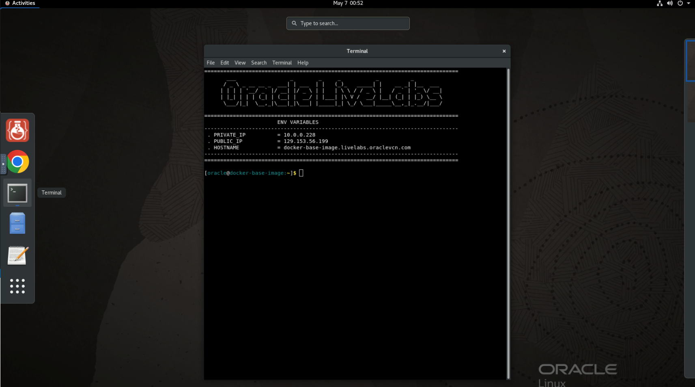
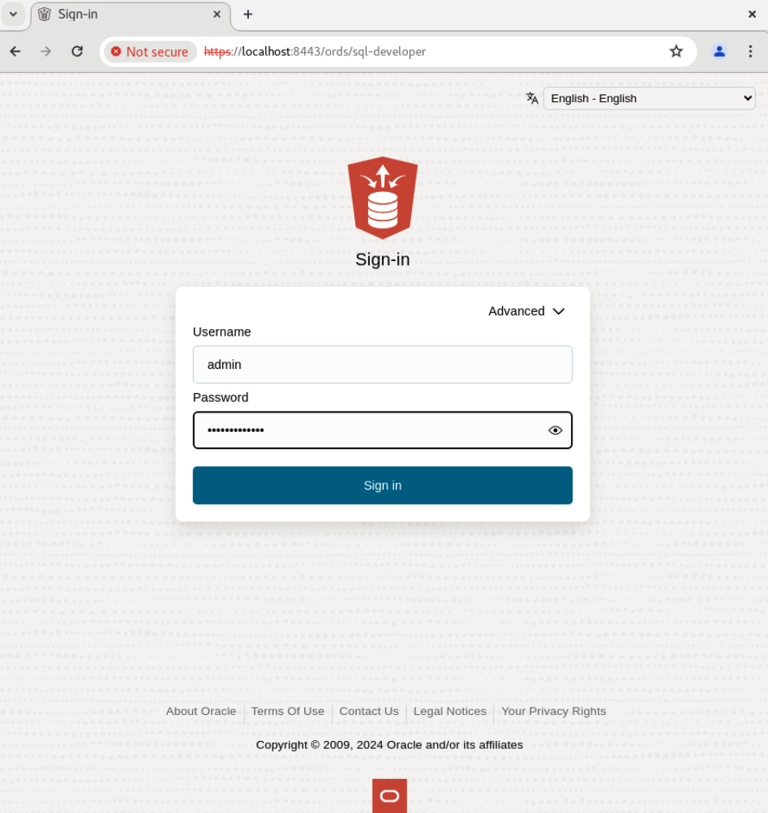

# Prepare Setup

## Introduction
This lab will show you how to pull, run, and start an Oracle Autonomous Database 23ai Docker image.

*Estimated Lab Time:* 10 minutes

### Prerequisites
This lab assumes you have:
- An Oracle account

## Task 1: Pull and start Docker image
1.  The terminal should be open, if not go to Activities and click Terminal.

    
 
2.  Run this command:

    ```
    <copy>
    podman login yyz.ocir.io
    </copy>
    ```

    

3. Now that you are prompted to login, type the username in the format of ***tenancy-name***/***username***. The password will be your ***auth-token***. You will find all the necessary information in the Login Details of your LiveLabs reservation. 

    

4. Hit enter, and it should say "Login Succeeded".

    

5. Run this following command, and it will pull down the latest version of the 23ai ADB image. Rerun the command if it fails.

    ```
    <copy>
    podman pull yyz.ocir.io/c4u04/livelabs:latest-23ai
    </copy>
    ```

    

6. Validate that the image has been pulled down.

    ```
    <copy>
    podman images
    </copy>
    ```

    

7. Run the image. Replace the WALLET PASSWORD and ADMIN PASSWORD variables with your own. Make sure your passwords are between 12-30 characters, with at least 1 uppercase letter, 1 lowercase letter, and 1 number.

    You can pass in 'ADW' (Autonomous Data Warehouse) instead of 'ATP' (Autonomous Transaction Processing) for Workload type if you choose.

    ```
    <copy>
    podman run -d \
    -p 1521:1522 \
    -p 1522:1522 \
    -p 8443:8443 \
    -p 27017:27017 \
    -e WORKLOAD_TYPE='ATP' \
    -e WALLET_PASSWORD='xxxxx' \
    -e ADMIN_PASSWORD='xxxxx' \
    --cap-add SYS_ADMIN \
    --device /dev/fuse \
    --name adb-free \
    yyz.ocir.io/c4u04/livelabs:latest-23ai
    </copy>
    ```

    

8. Wait a few minutes for the container to be healthy. It takes a bit to create the new wallet, bring up the database, change the admin password, and start ORDS. You can monitor the container status using:

    ```
    <copy>
    podman ps
    </copy>
    ```

    It should say (healthy), as opposed to (starting) under status before you move onto the next steps.

    

9. Take note of the container string that is output by the last command, and insert it into this following command before running.

    ```
    <copy>
    alias adb-cli="podman exec <container_string> adb-cli"
    </copy>
    ```

    

10. Now, the ADB container is live and you can run commands against it. You can view the list of available commands using the following command.

    ```
    <copy>
    adb-cli --help 
    </copy>
    ```

    


## Task 2: Access Database Actions and APEX

1. To access Database Actions/ORDS, open a new window in your Chrome browser and go to this website:

    ```
    <copy>
    https://localhost:8443/ords
    </copy>
    ```

    It must include the "https://" to work.

2. Click 'Advanced' then 'Proceed to localhost (unsafe)'.
    
    

3. Click 'Go' to SQL Developer Web.

    

4. Type in 'admin' for username and the password you had set as ADMIN_PASSWORD in the run command for Task 1, Step 6.

    

5. Underneath Development, click 'Open' for SQL or you can click SQL under Development in the hamburger menu in the top left.

    

    

6. Close out the tutorial that pops up when you open the worksheet.

    

7. We need to set the URL for APEX's image directory for it to work. We will do so by pasting in this command.

    ```
    <copy>
    begin
        APEX_INSTANCE_ADMIN.set_parameter(
            p_parameter => 'IMAGE_PREFIX',
            p_value => 'https://objectstorage.ca-toronto-1.oraclecloud.com/n/c4u04/b/apex-images/o/23.2.3/images/');
        commit;
    end;
    /
    </copy>
    ```

8. Allow clipboard to paste into SQL Developer worksheet.

    

9. Click the green play button to run the command. Make sure that it says 'PL/SQL procedure successfully completed.'

    

10. Go back to the ORDS URL, and this time click 'Go' underneath Oracle APEX.

    ```
    <copy>
    https://localhost:8443/ords
    </copy>
    ```

    

11. Sign in with the password you had set as ADMIN_PASSWORD in the run command for Task 1, Step 6.

    

12. Now you have access to Database Actions and APEX within your ADB 23ai Container Image! Feel free to explore what's possible within your environment.

<!-- 11. 
9. You can add a database.

    ```
    <copy>
    adb-cli add-database --workload-type "ADW" --admin-password "Welcome_1234"
    </copy>
    ```

10. You can change the admin password.

    ```
    <copy>
    adb-cli change-password --database-name "MYADW" --old-password "Welcome_1234" --new-password "Welcome_12345"
    </copy>
    ```

11. **Note:** At anytime, you can check if your container is still running with this command. The list returned should not be empty.

    ```
    <copy>
    podman ps -a
    </copy>
    ```

 11. 
mkdir /scratch/
podman cp adb-free:/u01/app/oracle/wallets/tls_wallet /scratch/tls_wallet

12. 

hostname fqdn -->


<!-- 11. This is how you connect to ORDS.

12. Finally, this is how you would connect to APEX. -->

## Acknowledgements
* **Author** - Kaylien Phan, Senior Product Manager
* **Contributors** - David Start
* **Last Updated By/Date** - Kaylien Phan, May 2024