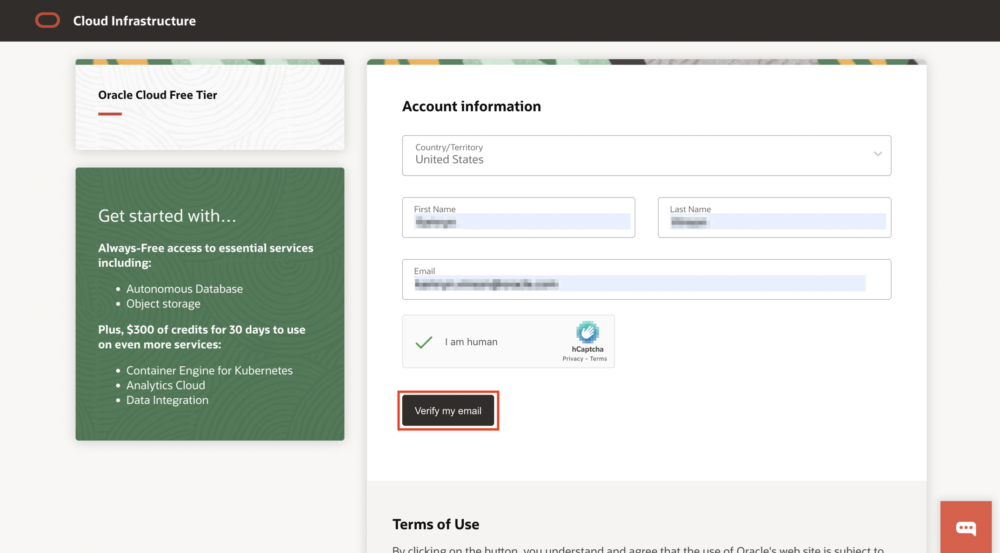
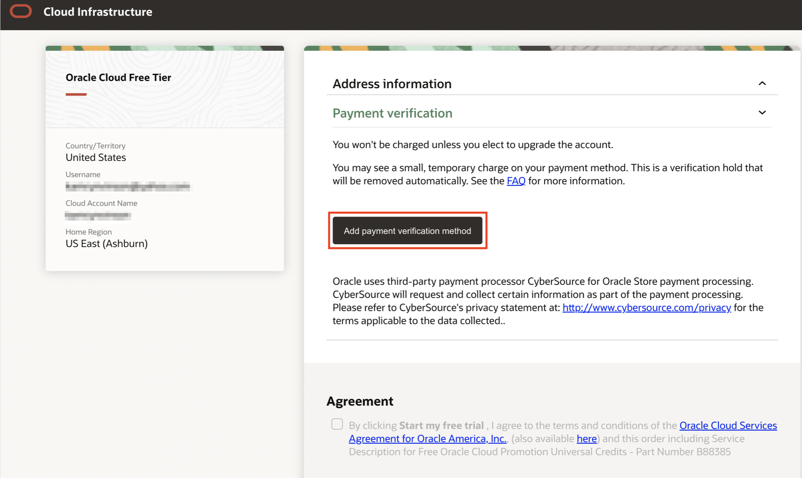
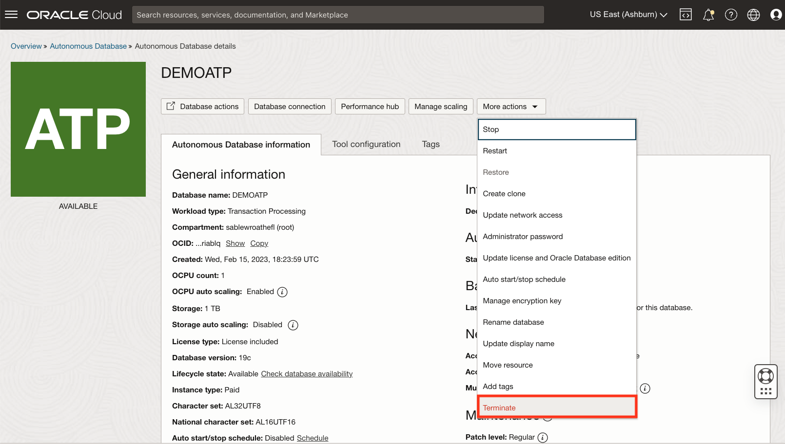
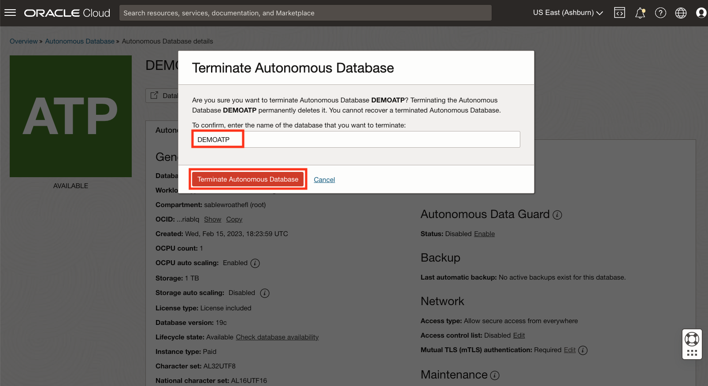

# My HOL runs on a Always free/Free Tier tenancy

## Introduction

Oracle Cloud is the industry's broadest and most integrated cloud provider, with deployment options ranging from the public cloud to your data center. Oracle Cloud offers best-in-class services across Software as a Service (SaaS), Platform as a Service (PaaS), and Infrastructure as a Service (IaaS).

### Types of Cloud Accounts

We offer two types of Cloud Accounts:

*Free Tier Accounts*:  After you sign up for the free Oracle Cloud promotion or sign up for a paid account, you’ll get a welcome email. The email provides you with your cloud account details and sign in credentials.

*Oracle Cloud Paid Accounts*:  When your tenancy is provisioned, Oracle sends an email to the default administrator at your company with the sign-in credentials and URL. This administrator can then create a user for each person who needs access to the Oracle Cloud. Check your email or contact your administrator for your credentials and account name.

### Objectives

- Sign up for an Oracle Cloud Free Tier Account
- Terminate an available or stopped Oracle Autonomous Database instance.

## Task 1:  Sign up for a free tier account

1. Go to [cloud.oracle.com](https://cloud.oracle.com) and click **Sign up**.

    

2. Fill in the Account Information and click **Verify my Email**. 

    

3. To create your account, please verify your email address by clicking the verification link sent to your email.

    

4. Fill in the Account Information and click **Continue**.

    

5. Fill in your Address Information and click **Continue**.

    

6. Click **Add payment verification method**.

    

7. Enter in your payment information. Check the agreement box and click **Start my free trial**.

    

8. Enter in your cloud account name and click **Next**.

    

9. Enter in your User Name and Password and click **Sign In**.

    

10. You are now signed in to Oracle Cloud!

    

## Task 2: Terminate Oracle Autonomous Database

You can permanently delete (terminate) instances that you no longer need. Terminating an Oracle Autonomous Database permanently deletes the database data. However, automatic backups are not deleted if you have chosen Recovery Appliance or NFS as a backup destination. You can delete automatic backups directly from the Recovery Appliance or NFS.

This task walks you through the steps to terminate an available or stopped Oracle Autonomous Database instance. For the purpose of this lab, an always free demo Oracle Autonomous Transaction Processing database instance named DEMOATP is provisioned in a compartment. *Note:* While this lab terminates an Oracle Autonomous Transaction Processing database, the steps are the same for terminating an Oracle Autonomous Data Warehouse database.

Estimated Time - 5 minutes

1. If you are using a Free Trial or Always Free account, in the Oracle Cloud console, you need to be in the region where your Oracle Autonomous Database resources is provisioned. You can see your current default **Region** in the top right-hand corner of the page. To change the default region, click on the **Region** drop-down and choose the region where your Oracle Autonomous Database resource is provisioned.

    

2. Click on the navigation menu, click **Oracle Database** and choose **Autonomous Transaction Processing** (ATP).

    **Note:** You can also directly access your Oracle Autonomous Transaction Processing service in the **Quick Actions** section of the dashboard.

    

3. From the compartment drop-down menu select the **Compartment** where your Oracle Autonomous Database resource is provisioned. If there were a long list of databases, you could filter the list by the **State** of the databases (Available, Stopped, Terminated, etc). You can also sort by **Workload Type**. In this demo, the **Transaction Processing** workload type is selected.

    
    

4. From the databases displayed, click **Display Name** of the database you wish to terminate.

    In this lab, we are terminating the available **DEMOATP** Oracle Autonomous Transaction Processing database instance. Click **DEMOATP**.

    

5. Click **More Actions**.

    

6. From the more actions drop-down, scroll down and click **Terminate**.

    

7. Confirm that you wish to terminate your Oracle Autonomous Database in the confirmation dialog. Type the database name in the input field and click **Terminate Autonomous Database**.

    In this lab, type **DEMOATP** and click **Terminate Autonomous Database**.

    

8.  Your instance will begin to terminate, the Lifecycle State will turn from Available to Terminating.

    

9. After a few minutes, once the instance is terminated, the Lifecycle state will change from Terminating to Terminated.

    

    You have successfully terminated an Oracle Autonomous Database instance.

## Learn More

* Click [here](https://docs.oracle.com/en-us/iaas/exadata/doc/eccmanagingadbs.html#GUID-A00BC3BB-3AE6-4FBF-AEAF-2D9C14CD1D9A) to know more about Managing Autonomous Databases.

## Acknowledgements

* **Author** - Kamryn Vinson, Oracle Database Product Management, Product Manager
* **Last Updated By/Date** - Kamryn Vinson, July 2022
