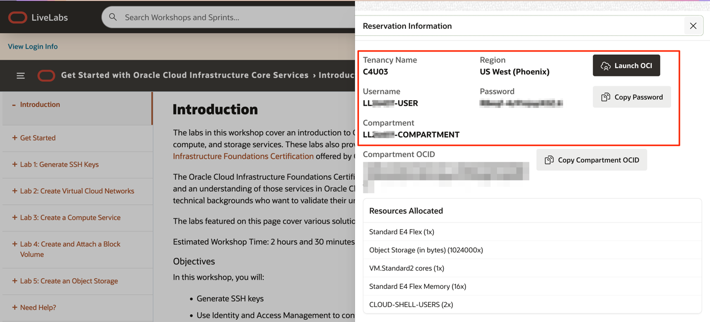
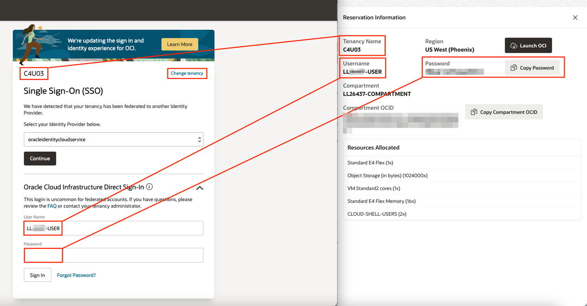
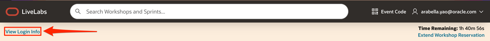

# General FAQ

## Introduction
You can refer to this page if you have any general questions about Oracle CloudWorld hands-on labs.

## I Cannot Sign up for a New Free Tier Account

1. Double check that the information you entered when you signed up for your OCI account is correct.

2. Check your emailbox, including *Junk Email* folder for the verification email.

3. Go to [Oracle Cloud Infrastructure Free Tier FAQ page](https://www.oracle.com/cloud/free/faq/) and contact the Oracle Cloud support team using the Chat link in the menu bar.

## My LiveLabs Sandbox Environment Does Not Work

1. Double check that you are using the information and credentials provided to you in the lab banner.

    

2. Make sure you are using the tenancy, username, and password provided to you in the lab banner.

    

3. If you need to view your login information anytime, click **View Login Info**.

    

## Can I Access the HOLs after CloudWorld?

Yes, you can still access the hands-on labs after CloudWorld. For more hands-on labs, go to [LiveLabs](https://oracle.com/livelabs/).

## Learn More

* Click [here](https://www.oracle.com/cloud/free/faq/) for Oracle Cloud Free Tier FAQs.

## Acknowledgements

* **Author** - Arabella Yao, Oracle Database Product Management, Product Manager
* **Last Updated By/Date** - Arabella Yao, July 2022
