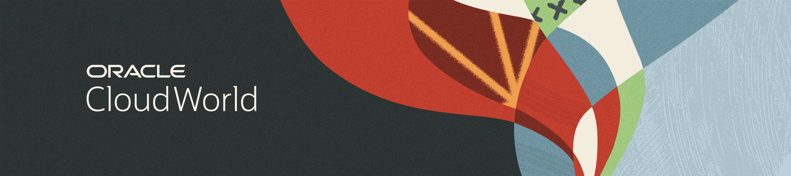
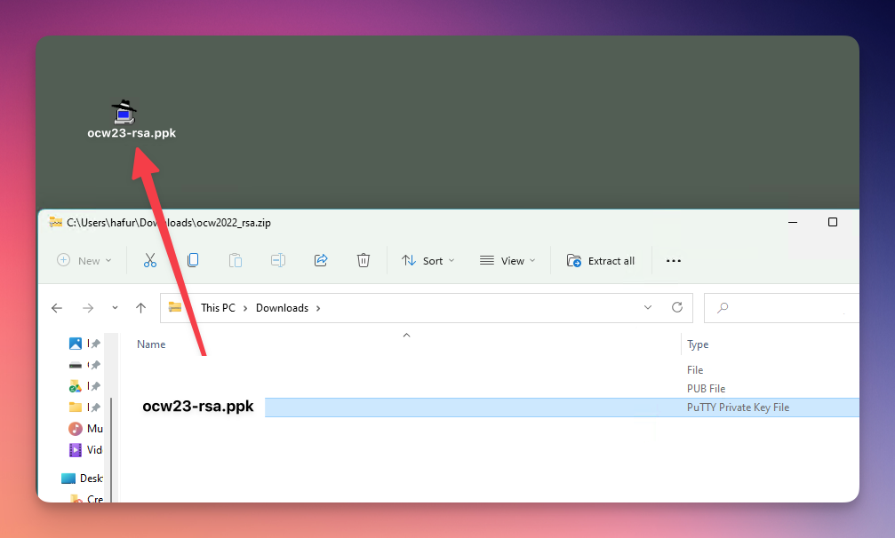
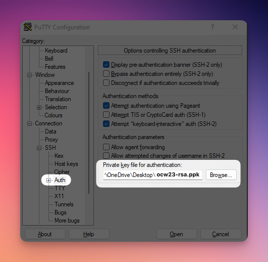
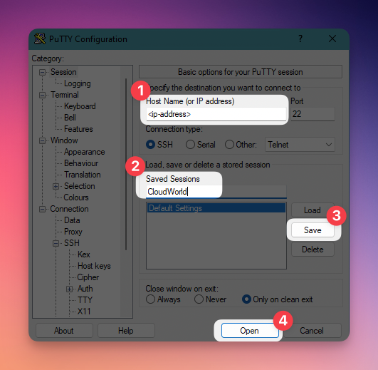
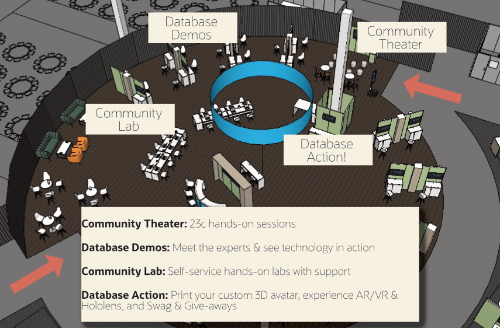
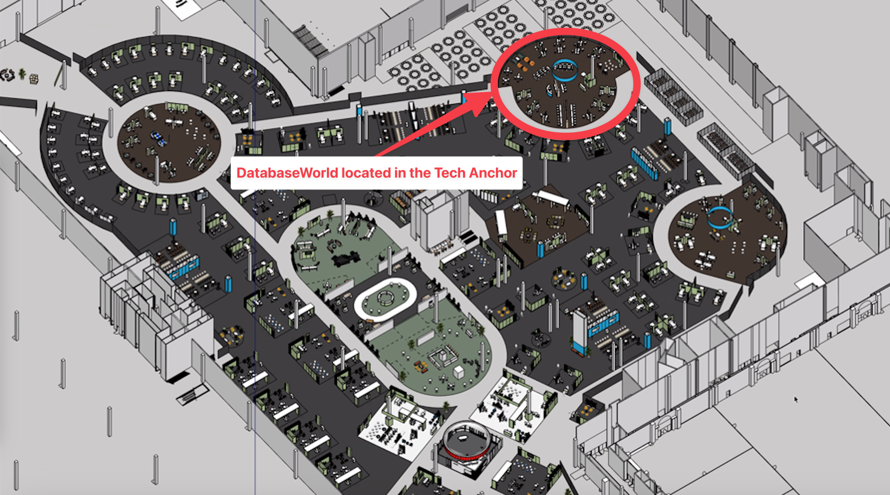

# Welcome to Oracle CloudWorld 2023!

## Introduction



It is our utmost pleasure to extend a warm welcome to you as you embark on the Oracle CloudWorld Hands-On Lab (HOL) Experience. We wholeheartedly encourage and invite you to actively participate in every session, fully immersing yourself in the hands-on lab activities by closely following the provided instructions. Your engagement is key to making this experience truly exceptional.

>In the following sections, you will discover frequently asked questions, technical requirements, and helpful tips and tricks.


## Technical Requirements for Hands-on Labs

All that's required is your laptop equipped with a modern web browser, and you'll be ready to start. To ensure you have the best and smoothest hands-on lab experience, we recommend using the following browsers and their minimum versions when accessing Oracle Cloud Infrastructure (OCI):

<b>
- Google Chrome 69 or later
- Safari 12.1 or later
- Firefox 62 or later (OCI Console does not support Firefox Private Browsing)
- Microsoft Edge 79 or later
</b>

## Get Your CloudWorld Oracle Cloud Free Tier Account

As part of your CloudWorld registration, you have the privilege to create a dedicated Oracle Cloud Free Tier account for CloudWorld. No payment information is required, and the registration process itself takes just a few minutes, allowing you to swiftly access and explore your Oracle Cloud Infrastructure account.


**Step-by-step guide: Sign up for an Oracle Cloud Free Tier Account**

1. Go to [http://signup.cloud.oracle.com](https://signup.cloud.oracle.com) 

2. Fill in the Account Information and click **Verify my Email**. 

    

3. To create your account, please verify your email address by clicking the verification link sent to your email.

    

4.  Congratulations! You unlocked the Oracle Cloud Free Tier trial account

    

5. Fill in the Account Information and click **Continue**.

    

6. Fill in your Address Information and click **Continue**.

    

7. Enter in your cloud account name and click **Next**.

    

8. Enter in your User Name and Password and click **Sign In**.

    

9. Next, you need to configure Multi-Factor-Authentication (MFA). Click **Enable Secure Verification** to start the process)

    

10. We support multiple ways for second-factor authentication:
    1.  Oracle Authenticator App (**recommended**).
    2.  3rd party authenticator apps, for example Google or Microsoft Authenticator.
    3.  FIDO, a hardware-enabled authentication using your device's security function such as fingerprints or facial recognition. Another hardware-enabled authentication can be performed using a hardware key, for example, a YubiKey.

    In this guide, we explain enabling MFA using the Oracle Authenticator App which can be downloaded in Apple App Store or Google PlayStore.

    Click **Mobile App** to start the process.

    

11. In the Authenticator App, tap **Add Account**. This will open the camera application. Now scan the QR code displayed in the web browser.

    

12. After scanning the QR code, your account is automatically enrolled for MFA. Please click **Done** to proceed.

    

13. You are now signed in to Oracle Cloud!

    

Here is a video demonstrating the MFA process:
[](videohub:1_0y3nn2ig)


##  Your Oracle Account

You are provided access to our Oracle Cloud environments in some hands-on labs. The use of those environments is free of charge, and there are no strings attached. We require you to log in using your Oracle Account to use those environments.

In case you forgot your Oracle Account credentials or you require a new one, have a look at the next paragraph:

**Step-by-step guide: Create an Oracle Account**

Creating an Oracle account can be summarized in the following two simple steps.

1. Navigate to [oracle.com](http://www.oracle.com), Click on *View Accounts*, and Select *Create an Account*

  

2. Fill out the form and click *Create Account*.

  

Click [here](https://www.oracle.com/corporate/contact/help.html) to learn more about your Oracle Account and how to get help if you forgot your username or password.


## How to use the LiveLabs Sandbox environment?

Here you can find a quick guide explaining how to access the LiveLabs Sandbox environment.

*Please note*: Some hands-on labs provide access to preconfigured environments using noVNC (see Step 2b). Your host will inform you about the applicable access method.

1. Using your *Oracle Account Login* go to [LiveLabs](https://oracle.com/livelabs). Open a workshop, click **Start**, and then **Run on LiveLabs** to request a reservation for this workshop.
  

1. Fill out information on the *Reserve Workshop* page. Check **I consent to receive emails from LiveLabs for my reservation**. Click **Submit Reservation**.
  

1. After creating a reservation for a LiveLab Workshop, you will receive an e-mail indicating that your reservation is being processed, followed by an e-mail indicating that your environment has been created.
  

>**Note:** You will receive the second created e-mail just before your selected reservation time.

### My workshop does not use noVNC

1. Log into LiveLabs. Click your username, and click **My Reservations**. Then click the **Launch Workshop** link for the Workshop environment you'd like to use. Note that you may have several Workshops listed.

  

2. Click **View Login Info** and click **Launch OCI**.

  

3. Use the provided tenancy name, user name, and password to log in to your Oracle Cloud account. 
  

4. After clicking **Sign In**, you are required to change your password to complete your login to Oracle Cloud.

  

5. If you need to view your login information anytime, click **View Login Info**.
  


### My workshops uses noVNC

1. Log into LiveLabs. Click your username, and click **My Reservations**. Then click the **Launch Workshop** link for the Workshop environment you'd like to use. Note that you may have several Workshops listed.

  

2. Click **View Login Info** and click **Launch Remote Desktop** to access the VM instance.

  

3. If you need to view your login information anytime, click **View Login Info**.
  


## Hands-on Labs using SSH keys


### Why do I need SSH Keys?
Some hands-on labs will use preprovisioned environments that may require you to log in via SSH to a specific server.
We have used a CloudWorld-specific SSH key pair to provision the environments to save you time. That way, you can start immediately with the hands-on exercises and not have to be concerned with the initial configuration.

In the following sections, we provide instructions on using the provided CloudWorld-specific SSH keys.


### Option 1 (**recommended**): Oracle Cloud Shell

Oracle Cloud Infrastructure comes out-of-the-box with a handy utility: Oracle Cloud Shell.
You can use Oracle Cloud Shell to connect to your remote server using SSH.

1. After you log in to OCI, open Oracle Cloud Shell. If it is the first time using Cloud Shell, it may take a minute or so to start up.

  

2. Download the SSH keys using wget
   
    ```
    <copy>
    wget https://developer.oracle.com/livelabs/ssh
    </copy>
    ```
3. Unzip the archive
   
    ```
    <copy>
    unzip ocw23-keys
    </copy>
    ```

   *Please note: The file does not have a file extension!*

   You will find the following files:

      * ocw23-rsa (private key)
      * ocw23-rsa.pub (public key)
      * ocw23-rsa.ppk (private key in Putty format - for Windows only)

4. Modify file permissions

    ```
    <copy>
    chmod 600 ocw23-rsa
    </copy>
    ```

5. Connect to the remote server using SSH

    ```
    <copy>
    ssh -i ocw23-rsa <user>@<ip-adress>
    </copy>
    ```

<hr>
<br>
### Option 2 (MacOS): Connect using MacOS Terminal

If you are using MacOS, you can also connect using a terminal application such as the default terminal application.

1. Open the terminal application of your choice:
   
   * Terminal (MacOs default)
   * iTerm2
   * MacTerm
   * Alacritty
   * ...

2. Download the SSH keys using wget
   
    ```
    <copy>
    wget https://developer.oracle.com/livelabs/ssh
    </copy>
    ```
3. Unzip the archive
   
    ```
    <copy>
    unzip ocw23-keys
    </copy>
    ```

   *Please note: The file does not have a file extension!*

   You will find the following files:

      * ocw23-rsa (privayte key)
      * ocw23-rsa.pub (public key)
      * ocw23-rsa.ppk (private key in Putty format - for Windows only)

4. Modify file permissions

    ```
    <copy>
    chmod 600 ocw23-rsa
    </copy>
    ```


5. Connect to the remote server using SSH

    ```
    <copy>
    ssh -i ocw23-rsa <user>@<ip-adress>
    </copy>
    ```

<hr>
<br>
### Option 3 (Putty): Connect using Putty on Windows

You can also use Putty to connect to the remote server.
You must have Putty installed. [Download Putty](https://www.putty.org/)

1. Download the ocw23-keys.zip using a browser of your choice from the following URL:

    ```
    <copy>
    https://developer.oracle.com/livelabs/ssh
    </copy>
    ```
2. Unzip the file and copy the file ocw23-rsa.ppk to a folder of your choice, for example to your Windows Desktop.

    

3. Open Putty and add ocw23-rsa.ppk to configuration settings

    

4. Provide connection details (optional step 2 and 3: save the settings for later use)

    

You will be prompted for the username once you click 'Open'

<hr>
<br>
### Option 4 (Windows PowerShell): Connect using Windows Powershell

If your Windows 10 or Windows 11 configuration allows to run SSH in PowerShell, you can use the following steps to connect to a remote server.
More information on using SSH in PowerShell can be found here: [PowerShell remote over SSH](https://learn.microsoft.com/en-us/powershell/scripting/learn/remoting/ssh-remoting-in-powershell-core)

1. Open Windows PowerShell

2. Download the SSH keys using wget
   
    ```
    <copy>
    wget https://developer.oracle.com/livelabs/ssh -outfile ocw23-keys.zip
    </copy>
    ```
3. Unzip the archive
   
    ```
    <copy>
    Expand-Archive .\ocw23-keys.zip
    </copy>
    ```

   *Please note: The file does not have a file extension!*

   You will find the following files:

      * ocw23-rsa (private key)
      * ocw23-rsa.pub (public key)
      * ocw23-rsa.ppk (private key in Putty format - for Windows only)
  
4. Connect to the remote server using SSH

    ```
    <copy>
    ssh -i ocw23-rsa <user>@<ip-adress>
    </copy>
    ```
<hr>
<br>
### Option 5 (Windows WSL): Connect using Windows Subsystem for Linux

You can use Windows Subsystem for Linux (WSL or WSL2) to connect to a remote server. You must have Windows Subsystem for Linux (WSL or WSL2) installed in order to use this method.

1. Open WSL shell

2. Download the SSH keys using wget
   
    ```
    <copy>
    wget https://developer.oracle.com/livelabs/ssh
    </copy>
    ```
3. Unzip the archive
   
    ```
    <copy>
    unzip ocw23-rsa
    </copy>
    ```

   *Please note: The file does not have a file extension!*

   You will find the following files:

      * ocw23-rsa (private key)
      * ocw23-rsa.pub (public key)
      * ocw23-rsa.ppk (private key in Putty format - for Windows only)

4. Modify file permissions

    ```
    <copy>
    chmod 600 ocw23-rsa
    </copy>
    ```

5. Connect to the remote server using SSH

    ```
    <copy>
    ssh -i ocw23-rsa <user>@<ip-adress>
    </copy>
    ```
<hr>
<br>
### Option 6 (Linux): Connect using Linux terminal

1. Open a terminal application in Linux

2. Download the SSH keys using wget
   
    ```
    <copy>
    wget https://developer.oracle.com/livelabs/ssh
    </copy>
    ```
3. Unzip the archive
   
    ```
    <copy>
    unzip ocw23-rsa
    </copy>
    ```

   *Please note: The file does not have a file extension!*

   You will find the following files:

      * ocw23-rsa (private key)
      * ocw23-rsa.pub (public key)
      * ocw23-rsa.ppk (private key in Putty format - for Windows only)

4. Modify file permissions

    ```
    <copy>
    chmod 600 ocw23-rsa
    </copy>
    ```

5. Connect to the remote server using SSH

    ```
    <copy>
    ssh -i ocw23-rsa <user>@<ip-adress>
    </copy>
    ```


##  Find other Hands-on Labs

Are you looking for the next hands-on lab to visit? Have a look at the [Session Catalog](https://reg.rf.oracle.com/flow/oracle/cwoh23/catalog/page/catalog)


## Visit the Oracle Community Theater and Community Lab!

Within the  Demogrounds, you'll discover the Community Theater and the Community Lab.

The Community Theater serves as the hub for this year's technical sessions, offering a comprehensive exploration of the cutting-edge features introduced in Oracle Database 23c. This immersive experience not only provides the quickest pathway to learning but also allows you to witness and experiment with the exciting innovations accompanying the release of Oracle Database 23c.

Within the Community Lab, we present an array of hands-on workshops that empower you to delve into these experiences at your own convenience. Simply take a seat and dive right in, whether it's on one of our readily available laptops or your personal device.



You can find the DatabaseWorld activities in the Tech Anchor within the CloudWorld Hub.




## Learn More

* Click [here](https://docs.oracle.com/en-us/iaas/Content/GSG/Tasks/signingin.htm#supported_browsers) to know more about the requirements for signing into Oracle Cloud Infrastructure.
* Click [here](https://github.com/novnc/noVNC#browser-requirements) to know more about the requirements for using noVNC.

## Acknowledgements

* **Author** - Kevin Lazarz, Oracle Database Product Management, Senior Principal Product Manager
* **Last Updated By/Date** - Kevin Lazarz, September 2023