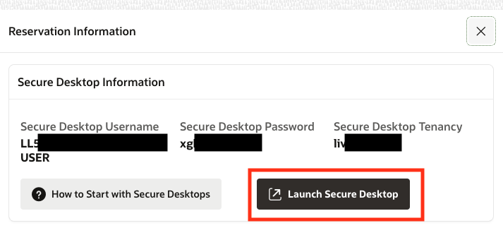
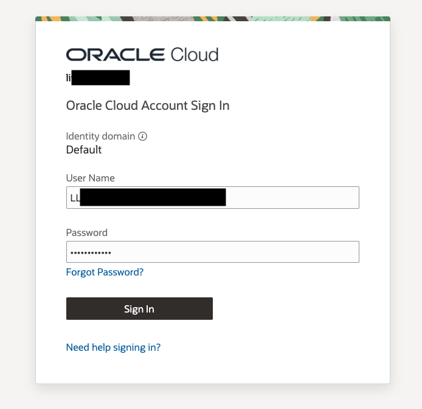
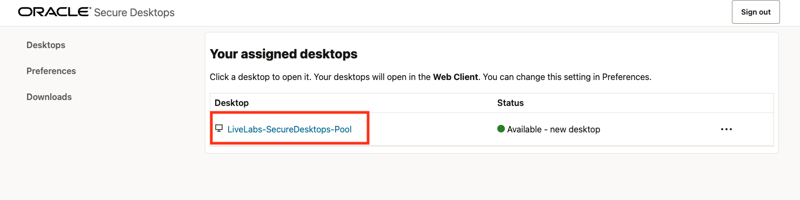
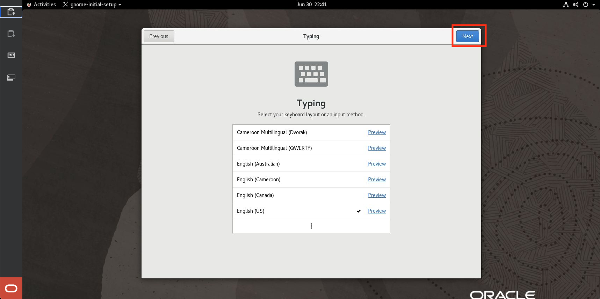
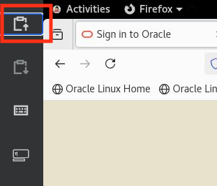

# Get Started with Secure Desktops

Use this guide to learn more about how to start with Secure Desktops! This guide will walk you through launching the desktop and provide a few tips to make using it easier! 

## Before you get Started

- Use Google Chrome as the browser. It's tools best support Secure Desktop. 
- Make sure you have pop-ups enabled in your browser. 
- You are logged out of any OCI tenants in the browser. 

## Step 1: Login to Secure Desktops

1. Click the **Launch Secure Desktop** button in LiveLabs. 

    

2. If you have another OCI session in your browser, you will need to click the "Sign in with a different user account" option after launching secure desktops. 

    

2. Enter the Desktop Tenancy name, found in the Secure Desktop Information section in LiveLabs. 

    

4. If you have to select an identity domain for the tenancy, please select the **Default** domain. 

    

3. Login with the Secure Desktop user information. You will have to provide a new password since this is the first login of the user. **NOTE:** If after logging in you see a blank page, simply refresh the page to reach the reset password screen.

    

    

4. Now you will see the Secure Desktops home page. You will see the desktops you have available to you. Click on the available desktop pool. This will begin provisioning a brand-new desktop for you to use. Please allow for 5-10 minutes for the compute instance to stand up. 

    **Note:** Secure Desktops use pop-ups. Please enable pop-ups in your browser settings before clicking on a Desktop Pool. 

    

    

5. Once the desktop has been created, a pop-up window will open and display your desktop. 

    **Note:** you will have to allow pop-ups in your browser settings if nothing pops up after the creation window closes. 

    If you notice that your desktop failed to open or otherwise has issues like the one below, try closing the window and click on the desktop pool again. After a bit more time, the desktop should open in another pop-up window. 

    

6. Once the desktop has been opened, click through the Oracle Linux setup screens. 

    

    

    

    

    

    

7. After finishing setup, you can open the Firefox browser by going to Activities > Firefox. 

    

8. With the browser open, you can navigate to **livelabs.oracle.com** to sign in and use your LiveLabs environment. 

    

## Appendix: Tips and Tricks for Secure Desktops 

1. You can use your local machine's clipboard by using the buttons on the left side of the screen. 

    - The top button imports your clipboard to the secure desktop. Use the top button to send information from your computer to the desktop.
        
    - The second button exports the secure desktop's clipboard to your local machine. Use the second button to get information from the desktop to your machine. 
        

2. If you are using a NoVNC image in LiveLabs, you may be confused with multiple layers of browser and remote desktop views. In order to minmize these intrutions, you can do the following: 

    - Go fullscreen with your brower. 
    - Remove the toolbar of your browser. In chrome, go to **View** and uncheck **Always Show Toolbar in Full Screen**. 