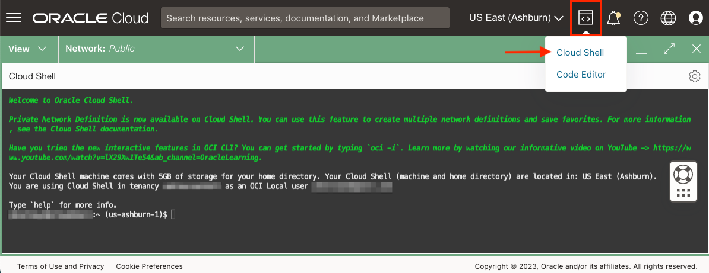
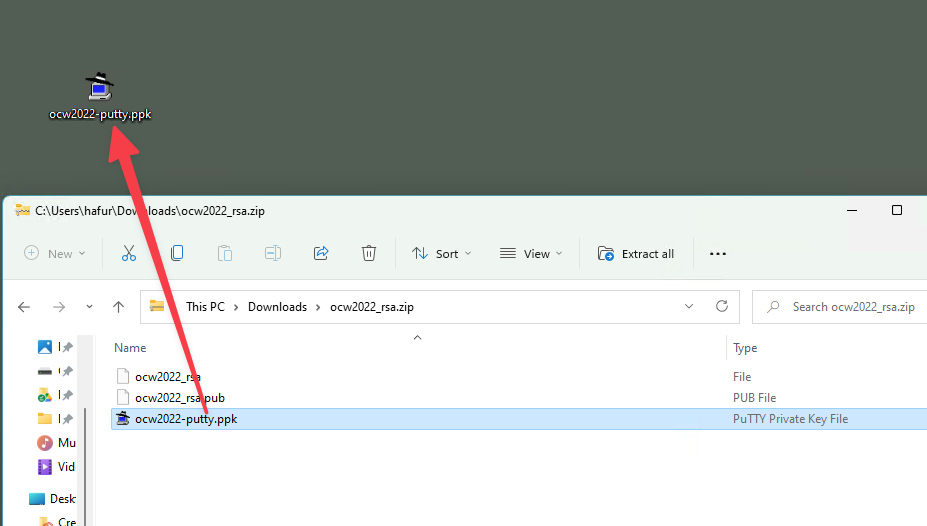
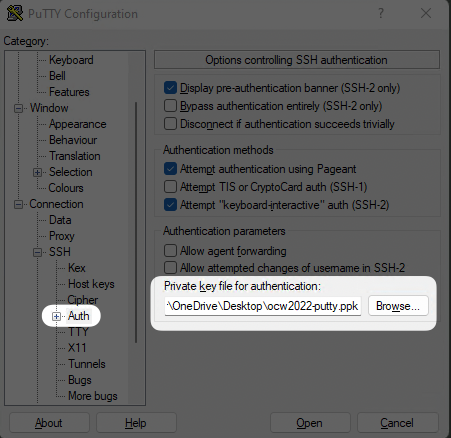

# Using the CloudWorld 2022 SSH Keys

## Why do I need SSH Keys?
Some hands-on labs will use pre-provisioned environments that may require you to log in via SSH to a specific server.
We have used a CloudWorld-specific SSH key pair to provision the environments to save you time. That way, you can start immediately with the hands-on exercises and not have to be concerned with the initial configuration.

In the following sections, we provide instructions on using the provided CloudWorld-specific SSH keys.


## Option 1 (recommended): Oracle Cloud Shell

Oracle Cloud Infrastructure comes out-of-the-box with a handy utlity: Oracle Cloud Shell.
You can use Oracle Cloud Shell to connect to your remote server using SSH.

1. After you log in to OCI, open Oracle Cloud Shell. If it is the first time using Cloud Shell, it may take a minute or so to start up.

  

2. Download the SSH keys using wget
   
    ```
    <copy>
    wget https://bit.ly/ocw22-ssh
    </copy>
    ```
3. Unzip the archive
   
    ```
    <copy>
    unzip ocw22-ssh
    </copy>
    ```

   *Please note: The file does not have a file extension!*

   You will find the following files:

      * ocw2022_rsa (privayte key)
      * ocw2022_rsa.pub (public key)
      * ocw2022-putty.ppk (private key in Putty format - for Windows only)

4. Modify file permissions

    ```
    <copy>
    chmod 600 ocw2022_rsa
    </copy>
    ```

5. Connect to the remote server using SSH

    ```
    <copy>
    ssh -i ocw2022_rsa <user>@<ip-adress>
    </copy>
    ```

## Option 2 (MacOS): Connect using MacOS Terminal

If you are using MacOS, you can also connect using a terminal application such as the default Termional application.

1. Open the terminal application of your choice:
   
   * Terminal (MacOs default)
   * iTerm2
   * MacTerm
   * Alacritty
   * ...

2. Download the SSH keys using wget
   
    ```
    <copy>
    wget https://bit.ly/ocw22-ssh
    </copy>
    ```
3. Unzip the archive
   
    ```
    <copy>
    unzip ocw22-ssh
    </copy>
    ```

   *Please note: The file does not have a file extension!*

   You will find the following files:

      * ocw2022_rsa (privayte key)
      * ocw2022_rsa.pub (public key)
      * ocw2022-putty.ppk (private key in Putty format - for Windows only)

4. Modify file permissions

    ```
    <copy>
    chmod 600 ocw2022_rsa
    </copy>
    ```

5. Connect to the remote server using SSH

    ```
    <copy>
    ssh -i ocw2022_rsa <user>@<ip-adress>
    </copy>
    ```


## Option 3 (Putty): Connect using Putty on Windows

You can also use Putty to connect to the remote server.
You must have Putty installed. [Download Putty](https://www.putty.org/)

1. Download the ocw22-rsa.zip using a browser of your choice from the following URL:

    ```
    <copy>
    https://bit.ly/ocw22-ssh
    </copy>
    ```
2. Unzip the file and copy the file ocw2022-putty.ppk to a folder of your choice, for example to your Windows Desktop.

    

3. Open Putty and add ocw2022-putty.ppk to configuration settings

    

4. Provide connection details (optional step 2 and 3: save the settings for later use)

    

You will be prompted for the username once you click 'Open'

## Option 4 (Windows PowerShell): Connect using Windows Powershell

If your Windows 10 or Windows 11 configuration allows to run SSH in PowerShell, you can use the following steps to connect to a remote server.
More information on using SSH in PowerShell can be found here: [PowerShell remoting over SSH](https://learn.microsoft.com/en-us/powershell/scripting/learn/remoting/ssh-remoting-in-powershell-core)

1. Open WindowsPowershell

2. Download the SSH keys using wget
   
    ```
    <copy>
    wget https://bit.ly/ocw22-ssh -outfile ocw-rsa.zip
    </copy>
    ```
3. Unzip the archive
   
    ```
    <copy>
    Expand-Archive .\ocw22-rsa.zip
    </copy>
    ```

   *Please note: The file does not have a file extension!*

   You will find the following files:

      * ocw2022_rsa (privayte key)
      * ocw2022_rsa.pub (public key)
      * ocw2022-putty.ppk (private key in Putty format - for Windows only)

3. Connect to the remote server using SSH

    ```
    <copy>
    ssh -i ocw2022_rsa <user>@<ip-adress>
    </copy>
    ```

## Option 5 (Windows WSL): Conenct using Windows Subsystem for Linux

You can use Windows Subsystem for Linux (WSL or WSL2) to connect to a remote server. You must have Windows Subsystem for Linux (WSL or WSL2) installed in order to use this method.

1. Open WSL shell

2. Download the SSH keys using wget
   
    ```
    <copy>
    wget https://bit.ly/ocw22-ssh
    </copy>
    ```
3. Unzip the archive
   
    ```
    <copy>
    unzip ocw22-ssh
    </copy>
    ```

   *Please note: The file does not have a file extension!*

   You will find the following files:

      * ocw2022_rsa (privayte key)
      * ocw2022_rsa.pub (public key)
      * ocw2022-putty.ppk (private key in Putty format - for Windows only)

4. Modify file permissions

    ```
    <copy>
    chmod 600 ocw2022_rsa
    </copy>
    ```

5. Connect to the remote server using SSH

    ```
    <copy>
    ssh -i ocw2022_rsa <user>@<ip-adress>
    </copy>
    ```

## Option 6 (Linux): Connect using Linux terminal

1. Open a terminal application in Linux

2. Download the SSH keys using wget
   
    ```
    <copy>
    wget https://bit.ly/ocw22-ssh
    </copy>
    ```
3. Unzip the archive
   
    ```
    <copy>
    unzip ocw22-ssh
    </copy>
    ```

   *Please note: The file does not have a file extension!*

   You will find the following files:

      * ocw2022_rsa (privayte key)
      * ocw2022_rsa.pub (public key)
      * ocw2022-putty.ppk (private key in Putty format - for Windows only

4. Modify file permissions

    ```
    <copy>
    chmod 600 ocw2022_rsa
    </copy>
    ```

5. Connect to the remote server using SSH

    ```
    <copy>
    ssh -i ocw2022_rsa <user>@<ip-adress>
    </copy>
    ```


