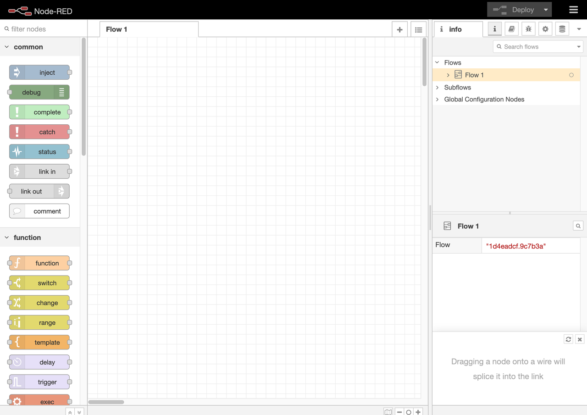
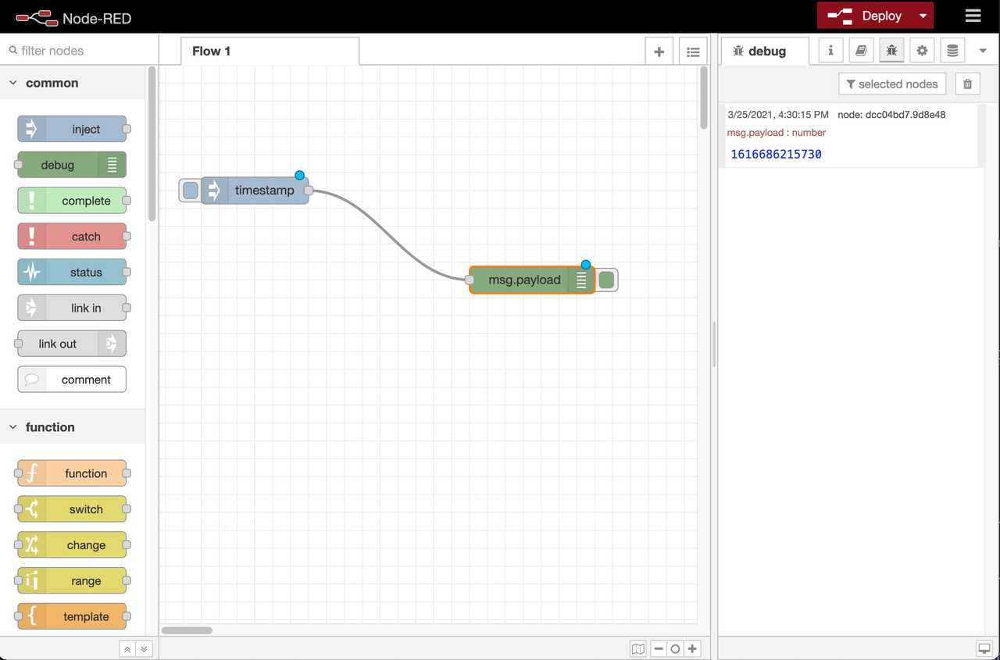

# Start using Node-RED

## Introduction

In this lab, you will learn how to start up Node-RED and start using it.

Estimated time: 20 minutes

### Objetives:
* Start up Node-RED
* Create a quick project

### Prerequisites
* A compute instance with OAL installed
* Network Security Lists and OAL firewall service allows ingress traffic on port 1880
* Node-RED is installed on OAL compute instance  
* Connected via SSH to the OAL compute instance

## Task 1: Start up Node-RED

In your SSH session, verify that you are on the Node-RED installation directory, for example (`/home/opc/node-red`).
Execute the following command in the Node-RED installation directory: `npm start`

## Task 2: Open Node-RED

Open a browser and navigate to `http://<public_ip_address>:1880` (the IP address of the OAL VM) in your browser. You should see the Node-RED workbench.

   

## Task 3: Implement a test flow

From the palette (the left panel) drag a _inject_ and a _debug_ node into the workspace. Connect the two nodes with each other by dragging between the output port from the inject node to the input port of the debug node. Now click the _Deploy_ button.

To test your first flow, click the inject button next to th inject node. You should see numbers appear in the debug sidebar. By default, the Inject node uses the number of milliseconds since January 1st, 1970 as its payload.

**Congratulations!* You have successfully installed Node-RED and implemented you very first flow!

## Acknowledgements
* **Author** - Kevin Lazarz, Product Manager 
* **Last Updated By/Date** - Kevin Lazarz, Product Manager, November 2021
